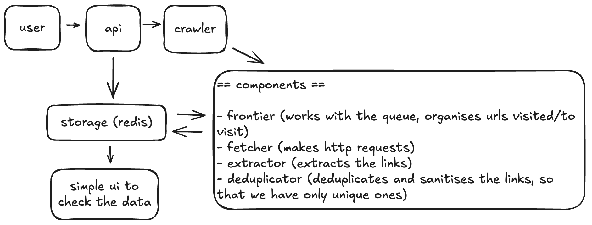

# Crawley


So I was asked to build a simple web crawler, and... well, this happened. What started as "just crawl a website and print the URLs" turned into a full web application because I might have gotten a bit carried away.

## What You're Looking At

This is a web crawler that definitely went beyond the original brief. Instead of a basic command-line tool, I built:

- **A proper web interface** - because staring at terminal output is boring
- **Real-time progress tracking** - watch it crawl and see what it finds as it happens  
- **Clean, modular code** - separated into logical pieces that don't make you want to cry when debugging
- **Production deployment ready** - Docker, Redis integration, proper error handling
- **Actually tested** - because untested code is just hope disguised as engineering

If you want the full story of why I built it this way, check out `ANS.md` where I explain all my questionable decisions.

## What It Actually Does

### The Crawler Itself
- Stays on one domain like a good little bot (but you can change which domain)
- Respects robots.txt because I'm not a monster
- Won't crawl the same page twice (even if the URLs look slightly different)
- Handles errors gracefully instead of just exploding

### The Web Interface (The Fun Part)
- Click a button to start crawling instead of typing commands
- Watch it work in real-time with live logs and progress updates
- See how many pages it's found, what's in the queue, and if anything's going wrong
- Browse through all the URLs it discovered, organized by patterns

### The Boring But Important Stuff  
- Can save data to Redis if you want persistence, or just keep it in memory if you don't
- Runs in Docker containers so you don't have to worry about "it works on my machine"
- The crawler runs separately from the web interface, so if it crashes, you can still see what happened
- Configurable everything - user agent, crawl depth, which domain to allow

## Getting Started

### If You Want to Run It Locally
```bash
pip install -r requirements.txt
npm install
npm run build
python web.py
```

### If You Just Want It to Work (Docker)
```bash
docker-compose up -d
```

Then open `http://localhost:5002` and you're good to go.

**Current Setup**: Docker Compose runs the crawler, Redis, and Redis UI containers together for easy local development.

**Production Considerations**: For real production deployment, you'd want to add load balancing, Redis clustering, and proper process supervision. The current setup is perfect for development and testing, but you'd need to beef it up for handling serious traffic.

## How to Use It

### The Easy Way (Web Interface)
1. Put in a URL you want to crawl (like `https://crawlme.monzo.com/`)
2. Tweak the settings if you want:
   - **User Agent**: What the crawler identifies itself as (some sites care about this)
   - **Allowed Domain**: Keep it on one domain or let it wander (probably keep it restricted)  
   - **Crawl Depth**: How many "clicks" deep to go (0 = just the start page, 1 = start page + links from it, etc.)
   - **Redis Storage**: Check this if you want your results to stick around after you close the browser
3. Hit "Start Crawl" and watch it do its thing

### The Old-School Way (Command Line)
If you're more of a terminal person:
```bash
python crawler.py https://crawlme.monzo.com/ --level 2 --use-storage
```

## How It's Built

### System Architecture



I split the crawler into logical pieces so it's not just one giant mess of code:

#### Core Components

- **Frontend**: React interface for crawl configuration and monitoring - because staring at terminal output is boring
- **Flask API**: HTTP endpoints and crawler process management - the bridge between your clicks and the actual work
- **Crawler Engine**: The heart of the system, broken into modular components:
  - **Frontier**: The traffic controller - manages what to crawl next and makes sure we stay on the right domain
  - **Fetcher**: Actually downloads the web pages (and deals with all the ways that can go wrong)
  - **Extractor**: Pulls links out of HTML and filters them  
  - **Deduplicator**: Makes sure we don't crawl the same page twice
- **Storage**: Redis persistence with in-memory fallback - saves stuff either to Redis or just in memory, depending on what you want

#### Architecture Design

**Process Isolation**: The web server and crawler run in separate processes for reliability and clean termination. This means if the crawler crashes or gets stuck, you can still see what happened and restart it without losing the web interface.

**Data Flow**: Frontend → API → Crawler subprocess → Redis. Logs stream back through the same path for real-time monitoring, so you can watch it work as it happens.

For way more detail on why I built it this way, check out `ANS.md` where I probably over-explain everything.

## If You Want to Hack on It

### Running the Tests
```bash
pytest tests/ -v
```

### Frontend Development
If you want to mess with the UI:
```bash
npm run watch        # Watches TypeScript files  
npm run watch:less   # Watches CSS files
```

### Docker Development  
Sometimes it's easier to just run everything in containers:
```bash
docker-compose up -d redis    # Just start Redis
docker-compose run --rm test  # Run tests in a container
```

## Configuration

You can tweak these environment variables if needed:
- `REDIS_HOST`: Where to find Redis (defaults to localhost)
- `REDIS_PASSWORD`: Redis password if you have one set up
- `PORT`: What port the web server runs on (defaults to 5000)
- `FLASK_DEBUG`: Set to 1 if you want verbose debug output

## Why I Built It This Way

I could have just written a quick script that prints URLs to the terminal, but where's the fun in that? Instead, I prioritized:

1. **Making it maintainable** - Future me (or future you) should be able to understand and modify this
2. **Making it actually deployable** - This could realistically run in production somewhere  
3. **Making it clear how it works** - The code structure should tell you what each piece does
4. **Making it useful** - A web interface is way more pleasant than watching text scroll by

Basically, I wanted to show how you'd build something for real, not just for a coding exercise.
